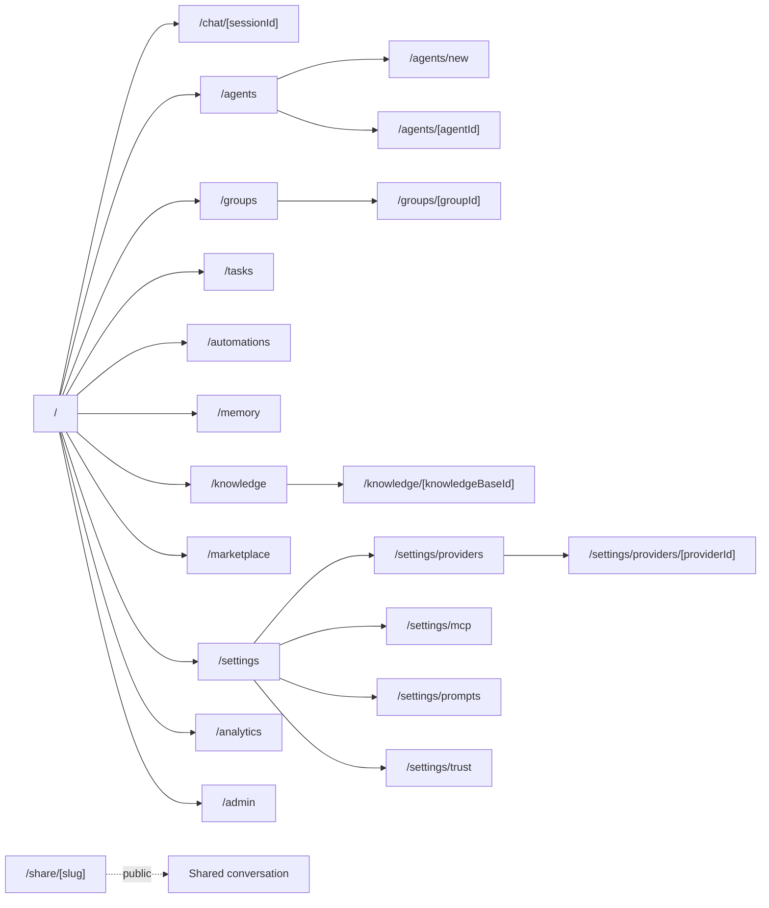
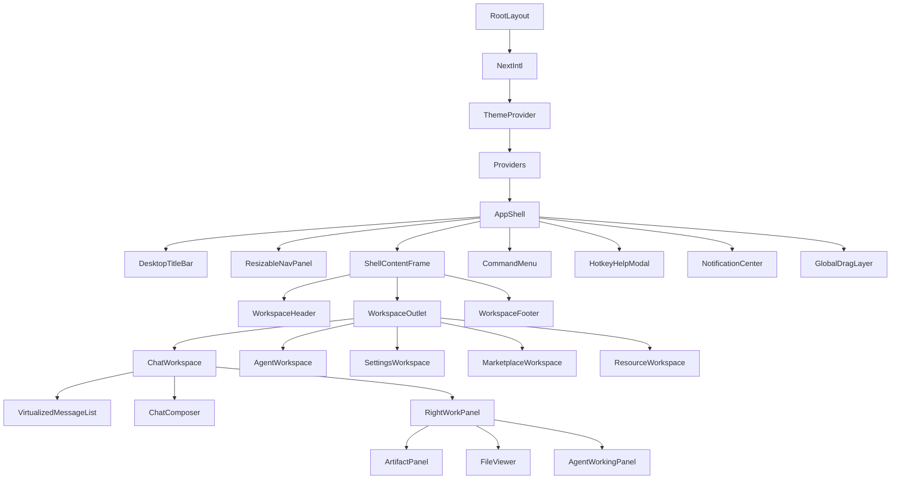

# AgentHub UI Plan - Information Architecture

## Current Sitemap

Current routes and view switches:

| Surface        | Current path or switch           | Current component                                                          |
| -------------- | -------------------------------- | -------------------------------------------------------------------------- |
| Home chat      | `/` + `mainView="chat"`          | `ChatInterface`                                                            |
| Agent builder  | `/` + `mainView="agent-builder"` | `AgentBuilder`                                                             |
| Group builder  | `/` + `mainView="group-builder"` | `AgentGroupBuilder`                                                        |
| Memory         | `/` + `mainView="memory-editor"` | `MemoryEditor`                                                             |
| Marketplace    | `/` + `mainView="marketplace"`   | `AgentMarketplace`                                                         |
| Tasks          | `/tasks` and `mainView="tasks"`  | `TaskManager`                                                              |
| Admin          | `/admin` and `mainView="admin"`  | `AdminPanel`                                                               |
| Knowledge base | `/kb`                            | `KnowledgeBaseManager`                                                     |
| Analytics      | `/analytics`                     | `AnalyticsDashboard`                                                       |
| Automations    | `/automations`                   | `AutomationsManager`                                                       |
| Settings       | `/settings`                      | `ProviderSettings`, `McpSettings`, `PromptLibraryManager`, `TrustSettings` |
| Shared chat    | `/share/[slug]`                  | public shared session page                                                 |

The current app mixes route navigation and Zustand `mainView` switching. This works for a prototype but limits deep-linking and makes the sidebar responsible for too many view transitions.

## Target Sitemap

Target route structure:

| Target path                        | Purpose                                 | Primary layout                  |
| ---------------------------------- | --------------------------------------- | ------------------------------- |
| `/`                                | Recent chats or selected chat workspace | `ChatWorkspace`                 |
| `/chat/[sessionId]`                | Addressable conversation                | `ChatWorkspace`                 |
| `/agents`                          | Agent list and management               | `AgentWorkspace`                |
| `/agents/new`                      | Create agent                            | `AgentSettingsWorkspace`        |
| `/agents/[agentId]`                | Edit agent                              | `AgentSettingsWorkspace`        |
| `/groups`                          | Multi-agent groups                      | `GroupWorkspace`                |
| `/groups/[groupId]`                | Edit group                              | `GroupWorkspace`                |
| `/tasks`                           | Agent tasks                             | `TaskWorkspace`                 |
| `/automations`                     | Scheduled runs                          | `AutomationWorkspace`           |
| `/memory`                          | White-box memory                        | `MemoryWorkspace`               |
| `/knowledge`                       | Knowledge bases and files               | `ResourceWorkspace`             |
| `/knowledge/[knowledgeBaseId]`     | KB detail                               | `ResourceWorkspace`             |
| `/marketplace`                     | Agent and skill marketplace             | `MarketplaceWorkspace`          |
| `/settings`                        | Settings landing                        | `SettingsWorkspace`             |
| `/settings/providers`              | Provider list                           | `ProviderSettingsWorkspace`     |
| `/settings/providers/[providerId]` | Provider details                        | `ProviderSettingsWorkspace`     |
| `/settings/mcp`                    | MCP servers                             | `McpSettingsWorkspace`          |
| `/settings/prompts`                | Prompt library                          | `PromptLibraryWorkspace`        |
| `/settings/trust`                  | Trust and governance                    | `TrustSettingsWorkspace`        |
| `/analytics`                       | Analytics                               | `AnalyticsWorkspace`            |
| `/admin`                           | Admin tools                             | `AdminWorkspace`                |
| `/share/[slug]`                    | Public shared chat                      | public layout, no private shell |

Transitional rule:

- Keep current paths working while adding deep links.
- Move `mainView` use toward route-derived state.
- Preserve `setMainView` only as a compatibility bridge until navigation is route-first.

## Target Shell Layout

Desktop layout:

```text
┌────────────────────────────────────────────────────────────────────┐
│ Optional DesktopTitleBar                                            │
├───────────────┬───────────────────────────────────────┬────────────┤
│ Resizable     │ ShellContentFrame                     │ Optional   │
│ NavPanel      │ ┌───────────────────────────────────┐ │ WorkPanel  │
│               │ │ WorkspaceHeader                   │ │            │
│ Home          │ ├───────────────────────────────────┤ │ Artifacts  │
│ Chats         │ │ Workspace body                    │ │ Files      │
│ Agents        │ │ chat / settings / resource / etc. │ │ Tasks      │
│ Groups        │ ├───────────────────────────────────┤ │ Agent      │
│ Tasks         │ │ Workspace footer or composer      │ │ Builder    │
│ Knowledge     │ └───────────────────────────────────┘ │            │
│ Settings      │                                       │            │
└───────────────┴───────────────────────────────────────┴────────────┘
```

Mobile layout:

```text
┌───────────────────────────────┐
│ MobileTopBar                  │
├───────────────────────────────┤
│ Workspace body                │
├───────────────────────────────┤
│ Composer or page actions      │
└───────────────────────────────┘

NavPanel opens as a drawer.
WorkPanel opens as a drawer or full-screen route.
```

## Nav Panel Model

Target panel slots:

| Slot          | Default content                       | LobeHub reference                             |
| ------------- | ------------------------------------- | --------------------------------------------- |
| `home`        | primary nav, agents, groups, chats    | `src/routes/(main)/home/_layout/*`            |
| `chat`        | chat sessions and active context      | `src/routes/(main)/agent/_layout/*`           |
| `settings`    | settings categories and provider list | `src/routes/(main)/settings/_layout/*`        |
| `marketplace` | marketplace filters/categories        | `src/routes/(main)/community/_layout/*`       |
| `resource`    | knowledge bases, files, folders       | `src/routes/(main)/resource/(home)/_layout/*` |
| `tasks`       | task filters, statuses, agents        | Lobe tasks/workflow surfaces from research    |

AgentHub implementation:

- `AppShell` owns `ResizableNavPanel`.
- Workspaces register a `navKey` and sidebar content.
- Sidebar content is a component, not embedded in `Sidebar.tsx`.
- Panel width, visibility, collapsed state, and section visibility are persisted.

## Route Graph



## Component Tree



## Panel Layout Rules

- The app shell controls viewport height and body overflow.
- Only inner workspace regions scroll.
- The left nav panel is the only persistent left column.
- Right-side panels are contextual and optional.
- Cards are used for repeated items, forms, modals, and tool surfaces, not page sections.
- Shell-level overlays mount once: command menu, hotkey help, notifications, drag overlay.
- Auth screens and public shared pages should not mount private workspace chrome.

## Deep-Linking Rules

- Chats must be linkable by session id.
- Settings subsections must be linkable by route.
- Marketplace filters should be query params.
- Knowledge base selection should be route or query state.
- Device-local preferences stay out of the URL.
- Long-running agent/task state should be persisted server-side and restorable by route.

## Migration Strategy

1. Add `AppShell` and route wrappers without changing visible behavior.
2. Move `Sidebar.tsx` into `NavPanel` pieces.
3. Add route aliases while preserving current `mainView`.
4. Convert one feature at a time from `mainView` to route-first navigation.
5. Remove `mainView` only after chat, agents, marketplace, memory, tasks, and admin have route targets.
