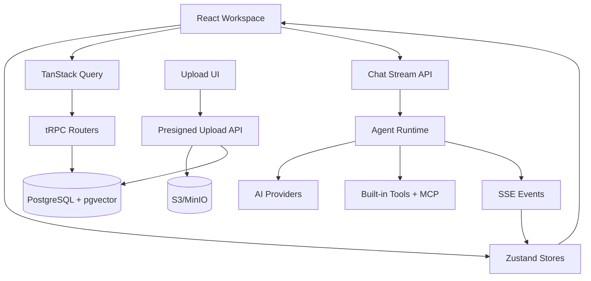

# AgentHub UI Plan - State and Data

## Current State Model

Primary file:

- `apps/web/src/stores/chatStore.ts`

Current `useChatStore` owns:

- sessions
- active session id
- generating state
- available models
- selected model
- agents
- agent groups
- memory entries
- `mainView`
- active agent/group ids
- mobile sidebar state

Current durable data sources:

- Drizzle schema in `apps/web/src/server/db/schema.ts`
- tRPC routers in `apps/web/src/server/routers/*`
- streaming APIs in `apps/web/src/app/api/chat/stream/route.ts` and `api/groups/stream/route.ts`
- upload and KB APIs in `apps/web/src/app/api/*`
- provider catalog/credentials through provider routers

Current client persistence:

- `theme` in localStorage
- `sidebar-collapsed` in localStorage
- React Query cache in memory
- Zustand store in memory

## Target Client Stores

Split state by ownership and persistence:

| Store               | Purpose                                                                       | Persistence                    | Initial source           |
| ------------------- | ----------------------------------------------------------------------------- | ------------------------------ | ------------------------ |
| `shellStore`        | nav panel width, collapse, active right panel, command open, hotkey help open | localStorage/settings          | new                      |
| `conversationStore` | sessions, active session, streaming state, pending checkpoint                 | server + memory                | extract from `chatStore` |
| `composerStore`     | per-session draft, attachments, slash query, height, fullscreen               | localStorage optional + memory | extract from `ChatInput` |
| `agentStore`        | agents, active agent/group cache                                              | server + memory                | extract from `chatStore` |
| `memoryStore`       | memory entries and local review state                                         | server + memory                | extract from `chatStore` |
| `notificationStore` | notifications/toasts                                                          | memory                         | new                      |
| `commandStore`      | command registry search/filter state                                          | memory                         | new                      |

Do not split all stores in one task. Start with `shellStore`, then extract stores as components are refactored.

## Persistence Strategy

Server-persisted user data:

- users/accounts/sessions
- agents and agent groups
- chat sessions and messages
- memories
- knowledge bases, documents, chunks, files
- provider credentials
- MCP servers
- prompt library
- automations and runs
- agent tasks
- API keys
- trust credentials/policies/audit logs

Device-local UI preferences:

- left panel width
- left panel collapsed
- sidebar section visibility/order
- chat composer height
- active right panel width
- theme mode
- command menu recents

Ephemeral runtime state:

- streaming buffer
- AbortController
- active orchestration step
- drag/drop active context
- transient toast state
- pending unsaved form edits

## Settings Table Use

The existing `settings` table can hold cross-device user preferences. Recommended split:

- use localStorage for device/layout preferences that should not roam between machines
- use `settings` table for user preferences that should roam, such as theme palette, default layout mode, default provider, and hotkeys

Proposed setting keys:

```text
ui.theme.mode
ui.theme.primaryColor
ui.theme.neutralColor
ui.layout.chatStyle
ui.sidebar.sectionOrder
ui.sidebar.hiddenSections
ui.hotkeys.bindings
ui.command.recentActions
```

Device-only localStorage keys:

```text
agenthub.shell.leftPanelWidth
agenthub.shell.leftPanelCollapsed
agenthub.shell.rightPanelWidth
agenthub.chat.composerHeight
```

## Data Flow



## Query Ownership

Keep server data fetching close to route/workspace boundaries:

- `ChatWorkspace` owns session/message queries.
- `AgentWorkspace` owns agent/group queries.
- `SettingsWorkspace` owns provider/MCP/trust/prompt queries.
- `ResourceWorkspace` owns KB/document/file queries.
- `MarketplaceWorkspace` owns catalog/install queries.

Child components should receive data and actions by props when practical. Use direct tRPC hooks in deeply isolated forms only where it avoids prop drilling.

## Streaming State

Current streaming behavior in `ChatInterface.tsx` should become a hook:

```ts
useChatStream({
  sessionId,
  model,
  agent,
  group,
  onChunk,
  onToolCall,
  onToolResult,
  onReasoning,
  onRagSources,
  onCheckpoint,
  onDone,
  onError,
});
```

Benefits:

- keeps `ChatWorkspace` smaller
- allows Playwright and node tests around stream event handling
- makes future artifacts/reasoning/tool timelines easier to wire

## Route State

Replace `mainView` gradually:

| Current `mainView` | Target route                         |
| ------------------ | ------------------------------------ |
| `chat`             | `/` or `/chat/[sessionId]`           |
| `agent-builder`    | `/agents/new` or `/agents/[agentId]` |
| `group-builder`    | `/groups/new` or `/groups/[groupId]` |
| `memory-editor`    | `/memory`                            |
| `marketplace`      | `/marketplace`                       |
| `tasks`            | `/tasks`                             |
| `admin`            | `/admin`                             |

During migration, keep `setMainView` as a bridge that calls `router.push()` and then updates compatibility state.

## Hydration Safety

Hydration-sensitive state:

- localStorage theme
- localStorage sidebar collapsed
- measured panel widths
- browser media query
- timestamps rendered with locale formatting
- extension-mutated SVG attributes

Rules:

- Do not render localStorage-derived layout values on the server.
- For persisted widths/collapsed state, render stable default then update after mount.
- Use client-only components for surfaces that require browser APIs.
- Format dates after mount or use fixed ISO/server-provided strings.
- Keep icon SVG output stable; do not branch icon props on `window`.

## Database Changes Likely Needed

UI shell work can start without DB migrations. Later phases likely need:

- user settings records for roaming UI/hotkey prefs
- right panel/artifact state if artifacts become durable workspace objects
- page/document tables for Pages/Notebooks
- file viewer metadata for citation anchors and page highlights
- command/action audit if command menu launches sensitive actions

Use Drizzle migrations and keep every table scoped by `userId` where data is private.

## Validation

Narrow validation for state refactors:

```bash
pnpm -C apps/web typecheck
pnpm test -- search-modal.test.mjs
pnpm test -- pin-conversations.test.mjs
pnpm -C apps/web test:e2e
```

Full validation:

```bash
pnpm validate
pnpm lint
pnpm -C apps/web test:e2e
git diff --check
```
