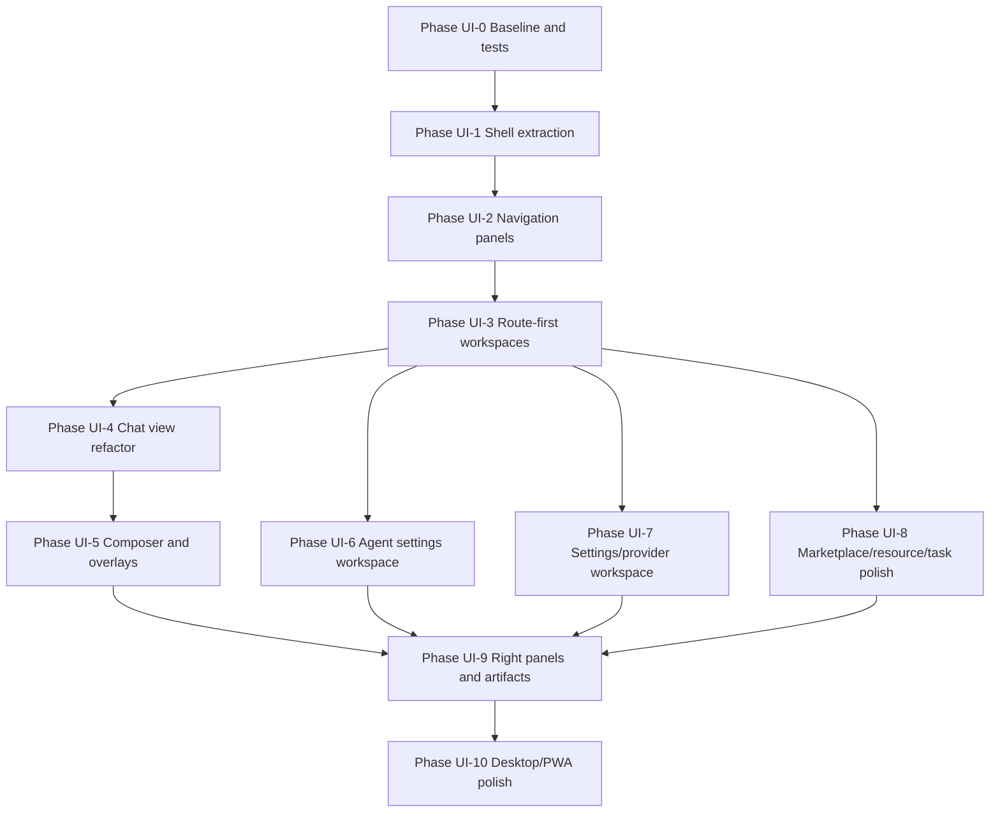

# AgentHub UI Plan - Implementation Roadmap

## Build Order

The roadmap mirrors LobeHub's shell-first approach while minimizing disruption to AgentHub's working chat/runtime behavior.



## Phase UI-0 - Baseline and Test Harness

Estimate: 0.5-1 day

Tasks:

- Capture current Playwright screenshots for `/`, `/settings`, `/kb`, `/tasks`, `/automations`, `/analytics`.
- Add smoke tests for sidebar collapse, new chat, command/search modal, settings route, KB route, and chat send with mocked stream where possible.
- Document current known dirty files before edits.

Files:

- `apps/web/e2e/chat-smoke.spec.ts`
- new `apps/web/e2e/workspace-shell.spec.ts`
- `docs/ui-plan/*`

Validation:

```bash
pnpm -C apps/web test:e2e
pnpm -C apps/web typecheck
```

Done when:

- Baseline tests pass before UI shell changes.
- Screenshots establish current layout for regression comparison.

## Phase UI-1 - Shell Extraction

Estimate: 2-3 days

Tasks:

- Create `AppShell`, `ShellContentFrame`, `NotificationCenter`, and `GlobalDragLayer` placeholders.
- Move authenticated layout logic from `app/page.tsx` into `AppShell`.
- Keep existing visible UI behavior.
- Add `shellStore` with mounted-safe localStorage persistence.
- Move command/search modal and keyboard shortcuts under shell.

Files:

- Create `apps/web/src/components/shell/AppShell.tsx`
- Create `apps/web/src/components/shell/ShellContentFrame.tsx`
- Create `apps/web/src/components/shell/shellStore.ts`
- Create `apps/web/src/components/shell/NotificationCenter.tsx`
- Create `apps/web/src/components/shell/GlobalDragLayer.tsx`
- Modify `apps/web/src/app/page.tsx`
- Modify `apps/web/src/components/SearchModal.tsx`
- Modify `apps/web/src/components/KeyboardShortcuts.tsx`

Validation:

```bash
pnpm -C apps/web typecheck
pnpm -C apps/web test:e2e -- chat-smoke.spec.ts
git diff --check
```

Done when:

- User-facing layout is unchanged.
- Shell owns overlays.
- No hydration warning is introduced.

## Phase UI-2 - Navigation Panels

Estimate: 3-5 days

Tasks:

- Split `Sidebar.tsx` into `ResizableNavPanel`, `PrimaryNav`, `SessionNavList`, `AgentNavList`, `GroupNavList`, and footer controls.
- Add width persistence with min/default/max tokens.
- Add named nav panel support for `home`, `settings`, `marketplace`, `resource`, and `tasks`.
- Preserve mobile drawer behavior.
- Add section visibility/order persistence.

Files:

- Modify `apps/web/src/components/Sidebar.tsx`
- Create `apps/web/src/components/navigation/NavItem.tsx`
- Create `apps/web/src/components/navigation/PrimaryNav.tsx`
- Create `apps/web/src/components/navigation/SessionNavList.tsx`
- Create `apps/web/src/components/navigation/SidebarSection.tsx`
- Create `apps/web/src/components/shell/NavPanelProvider.tsx`
- Create `apps/web/src/components/shell/ResizableNavPanel.tsx`

Validation:

```bash
pnpm -C apps/web typecheck
pnpm test -- pin-conversations.test.mjs
pnpm -C apps/web test:e2e -- workspace-shell.spec.ts
```

Done when:

- Collapse, mobile open, session select, pin, rename, delete, new chat, new agent, and new group still work.
- Panel width persists after reload.

## Phase UI-3 - Route-First Workspaces

Estimate: 3-4 days

Tasks:

- Add route-first pages for chat, agents, groups, memory, marketplace, and knowledge.
- Convert `setMainView` calls to router navigation with compatibility state.
- Keep existing `/kb`, `/tasks`, `/settings`, `/analytics`, `/automations`, and `/admin` routes.
- Add active nav state from pathname.

Files:

- Create `apps/web/src/app/chat/[sessionId]/page.tsx`
- Create `apps/web/src/app/agents/page.tsx`
- Create `apps/web/src/app/agents/new/page.tsx`
- Create `apps/web/src/app/agents/[agentId]/page.tsx`
- Create `apps/web/src/app/groups/page.tsx`
- Create `apps/web/src/app/groups/[groupId]/page.tsx`
- Create `apps/web/src/app/memory/page.tsx`
- Create `apps/web/src/app/marketplace/page.tsx`
- Create `apps/web/src/app/knowledge/page.tsx`
- Modify `apps/web/src/stores/chatStore.ts`
- Modify navigation components

Validation:

```bash
pnpm -C apps/web typecheck
pnpm -C apps/web test:e2e
```

Done when:

- Deep links render the expected workspace.
- Existing home flow still works.
- Public `/share/[slug]` is not wrapped in private shell.

## Phase UI-4 - Chat View Refactor

Estimate: 4-6 days

Tasks:

- Extract `useChatStream` from `ChatInterface.tsx`.
- Split message renderers from `ChatMessage.tsx`.
- Create `MarkdownRenderer`, `ReasoningTimeline`, `AssistantMessage`, `UserMessage`, and `ToolMessage`.
- Preserve RAG citations, Mermaid, math, code copy, TTS, feedback, edit, branch, and regenerate behavior.
- Keep `VirtualizedMessageList` as the list engine.

Files:

- Modify `apps/web/src/components/ChatInterface.tsx`
- Modify `apps/web/src/components/ChatMessage.tsx`
- Create `apps/web/src/components/chat/useChatStream.ts`
- Create `apps/web/src/components/chat/MessageItem.tsx`
- Create `apps/web/src/components/chat/AssistantMessage.tsx`
- Create `apps/web/src/components/chat/UserMessage.tsx`
- Create `apps/web/src/components/chat/ToolMessage.tsx`
- Create `apps/web/src/components/chat/MarkdownRenderer.tsx`
- Create `apps/web/src/components/chat/ReasoningTimeline.tsx`

Validation:

```bash
pnpm test -- chat-stream.test.mjs
pnpm test -- chat-stream-behavioral.test.ts
pnpm test -- rag-citations.test.mjs
pnpm test -- message-feedback.test.mjs
pnpm -C apps/web test:e2e -- chat-smoke.spec.ts
```

Done when:

- Streaming, tools, reasoning, citations, branching, edit/regenerate, and feedback behave exactly as before.

## Phase UI-5 - Composer and Overlays

Estimate: 4-7 days

Tasks:

- Upgrade `ChatInput` into `ChatComposer`.
- Add `ComposerActionBar`, `AttachmentTray`, and `ContextTray`.
- Persist composer height after mount.
- Extend slash prompt behavior without breaking current prompt library.
- Add drag-upload overlay for chat.
- Upgrade `SearchModal` into `CommandMenu` with route/create/theme/settings actions.
- Add hotkey helper modal.

Files:

- Modify `apps/web/src/components/ChatInput.tsx`
- Create `apps/web/src/components/chat/ChatComposer.tsx`
- Create `apps/web/src/components/chat/ComposerActionBar.tsx`
- Create `apps/web/src/components/chat/AttachmentTray.tsx`
- Create `apps/web/src/components/chat/ContextTray.tsx`
- Create `apps/web/src/components/command/CommandMenu.tsx`
- Create `apps/web/src/components/command/commandRegistry.ts`
- Modify `apps/web/src/components/SearchModal.tsx`
- Modify `apps/web/src/components/KeyboardShortcuts.tsx`

Validation:

```bash
pnpm test -- prompt-library.test.mjs
pnpm test -- search-modal.test.mjs
pnpm -C apps/web test:e2e
```

Done when:

- Send, stop, attach, voice input, slash prompts, keyboard send, and command menu all work from keyboard and mouse.

## Phase UI-6 - Agent Settings Workspace

Estimate: 4-6 days

Tasks:

- Split `AgentBuilder.tsx` into tabbed sections.
- Add route-first new/edit views.
- Add right-side builder assistant placeholder.
- Add model/tool/opening/knowledge tabs.
- Preserve export/delete/save behavior.

Files:

- Modify `apps/web/src/components/AgentBuilder.tsx`
- Create `apps/web/src/components/agents/AgentSettingsWorkspace.tsx`
- Create `apps/web/src/components/agents/AgentSettingsTabs.tsx`
- Create `apps/web/src/components/agents/AgentPromptEditor.tsx`
- Create `apps/web/src/components/agents/AgentModelForm.tsx`
- Create `apps/web/src/components/agents/AgentToolSelector.tsx`
- Create `apps/web/src/components/agents/AgentBuilderAssistantPanel.tsx`

Validation:

```bash
pnpm test -- agent-crud-isolation.test.mjs
pnpm -C apps/web typecheck
pnpm -C apps/web test:e2e
```

Done when:

- Create/edit/delete/export agent flows pass.
- Agent settings are addressable by route.

## Phase UI-7 - Settings and Provider Workspace

Estimate: 3-5 days

Tasks:

- Convert `/settings` from a long vertical page into sidebar/detail layout.
- Move provider settings into `/settings/providers`.
- Preserve GitHub Copilot OAuth, model fetch, credential test, and delete flows.
- Move MCP, prompt library, trust, and language into settings subroutes.

Files:

- Modify `apps/web/src/app/settings/page.tsx`
- Create `apps/web/src/app/settings/providers/page.tsx`
- Create `apps/web/src/app/settings/mcp/page.tsx`
- Create `apps/web/src/app/settings/prompts/page.tsx`
- Create `apps/web/src/app/settings/trust/page.tsx`
- Create `apps/web/src/components/settings/SettingsWorkspace.tsx`
- Modify `apps/web/src/components/ProviderSettings.tsx`

Validation:

```bash
pnpm test -- mcp-settings.test.mjs
pnpm test -- mcp-security.test.mjs
pnpm test -- security-coverage.test.mjs
pnpm -C apps/web test:e2e
```

Done when:

- Each settings section has a route and active sidebar item.
- Provider credential actions still work.

## Phase UI-8 - Marketplace, Resource, and Task Polish

Estimate: 5-8 days

Tasks:

- Convert marketplace into query-driven tabs and virtualized grid.
- Convert KB page into resource workspace with file list/detail split.
- Add file viewer placeholder with safe supported types.
- Add task filters and right-side task detail panel.

Files:

- Modify `apps/web/src/components/AgentMarketplace.tsx`
- Modify `apps/web/src/components/KnowledgeBaseManager.tsx`
- Modify `apps/web/src/components/TaskManager.tsx`
- Create `apps/web/src/components/marketplace/MarketplaceGrid.tsx`
- Create `apps/web/src/components/resource/FileViewer.tsx`
- Create `apps/web/src/components/tasks/TaskDetailPanel.tsx`

Validation:

```bash
pnpm test -- kb-rag.test.mjs
pnpm test -- tasks.test.mjs
pnpm -C apps/web test:e2e
```

Done when:

- Marketplace, KB/resource, and task workflows remain functional in the new shell.

## Phase UI-9 - Right Panels and Artifacts

Estimate: 5-8 days

Dependencies:

- SSRF/XSS protection from the broader feature roadmap before rendering user/AI HTML artifacts.

Tasks:

- Add `RightWorkPanel` modes for artifacts, files, agent builder, and tasks.
- Wire `messages.artifacts` into `ArtifactPanel`.
- Add sandboxed iframe preview after sanitizer is implemented.
- Add file/citation viewer integration.
- Add panel persistence and keyboard toggle.

Files:

- Create `apps/web/src/components/panels/ArtifactPanel.tsx`
- Create `apps/web/src/components/panels/AgentWorkingPanel.tsx`
- Create `apps/web/src/components/panels/FilePanel.tsx`
- Modify `apps/web/src/components/shell/RightWorkPanel.tsx`
- Modify message renderers

Validation:

```bash
pnpm test -- security-coverage.test.mjs
pnpm -C apps/web test:e2e
```

Done when:

- Right panel opens/closes/resizes reliably.
- Artifacts are sanitized and sandboxed before preview.

## Phase UI-10 - Desktop/PWA Polish

Estimate: 3-6 days for web polish; desktop shell TBD

Tasks:

- Improve PWA viewport behavior and offline fallback.
- Add desktop title-bar abstraction behind a feature flag.
- Add no-drag/drag CSS only when desktop runtime exists.
- Add screenshot regression checks for desktop and mobile viewports.

Files:

- Modify `apps/web/src/app/globals.css`
- Modify `apps/web/src/components/shell/DesktopTitleBar.tsx`
- Modify `apps/web/src/components/ServiceWorkerRegistrar.tsx`
- Add Playwright screenshot specs

Validation:

```bash
pnpm -C apps/web test:e2e
pnpm validate
```

Done when:

- PWA remains installable.
- Desktop-specific UI does not affect web hydration or accessibility.

## Global Acceptance Criteria

- No new hydration mismatch warnings.
- No LobeHub branding/assets copied.
- Existing chat, agent, KB, tasks, settings, provider, MCP, and auth flows still pass.
- Mobile nav remains usable at `390x844`.
- Desktop layout remains stable at `1440x1000`.
- `pnpm validate`, `pnpm lint`, `pnpm -C apps/web test:e2e`, and `git diff --check` pass before completion.
