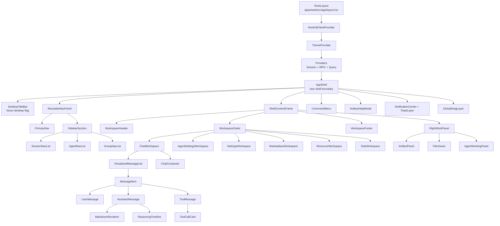
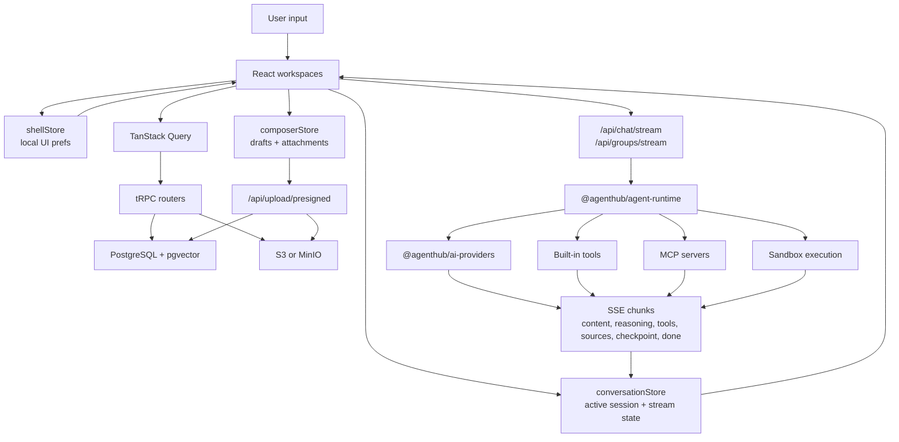
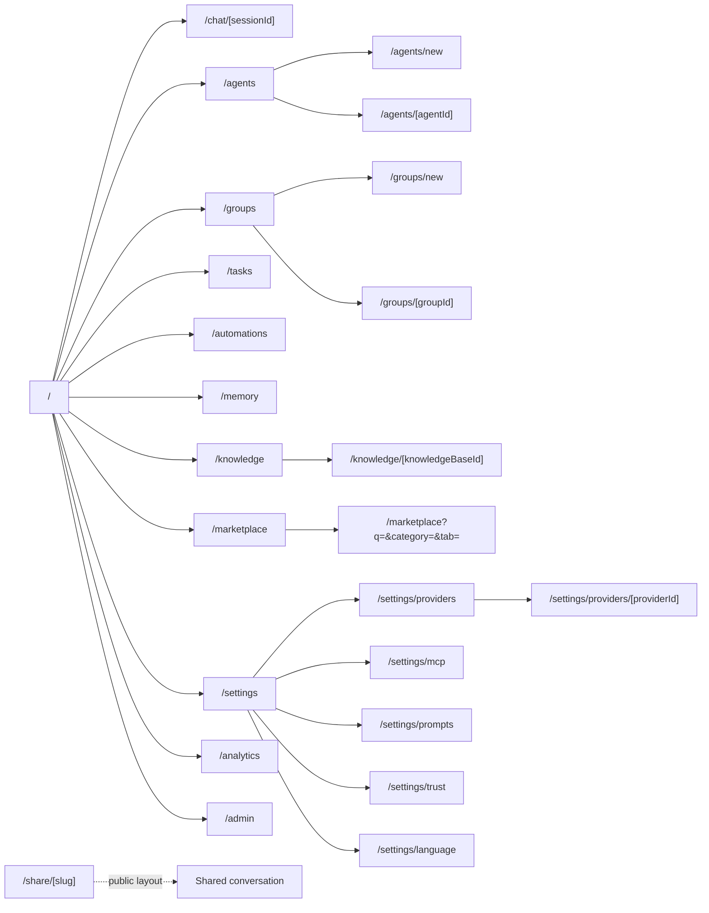

# AgentHub UI Plan - Validation Deliverables

Created: 2026-05-15
Scope: Phase 4 validation artifacts for the LobeHub-to-AgentHub UI adaptation plan.

## Side-by-Side Comparison

Status legend:

- Existing: AgentHub already has a usable version.
- Partial: AgentHub has a foundation but needs refactor or expansion.
- Planned: covered by this UI plan and not yet implemented.
- Deferred: intentionally held until a dependency or ADR is complete.

| LobeHub feature or pattern                                     | AgentHub planned implementation                                                                                                                          | Status   |
| -------------------------------------------------------------- | -------------------------------------------------------------------------------------------------------------------------------------------------------- | -------- |
| Global app shell wrapping all private workspaces               | Add `AppShell` with shell-owned nav, content frame, overlays, command menu, hotkeys, notifications, and drag layer.                                      | Planned  |
| Desktop inner layout container                                 | Add `ShellContentFrame` using Tailwind tokens and clipped workspace regions.                                                                             | Planned  |
| Named nav panel portal                                         | Add `NavPanelProvider` and `ResizableNavPanel` with active panel keys for home, settings, marketplace, resource, and tasks.                              | Planned  |
| Resizable persisted left panel                                 | Add mounted-safe `shellStore` with width/collapse persistence.                                                                                           | Planned  |
| Desktop title bar, tabs, and native navigation                 | Add `DesktopTitleBar` abstraction behind a future desktop feature flag.                                                                                  | Deferred |
| Sidebar sections with agents, recents, hidden/reorder controls | Split `Sidebar.tsx` into `PrimaryNav`, `SidebarSection`, `SessionNavList`, `AgentNavList`, and `GroupNavList`; add section visibility/order persistence. | Partial  |
| Route-first deep linking                                       | Add routes for chat sessions, agents, groups, memory, marketplace, knowledge, and settings subsections; keep `mainView` as temporary bridge.             | Planned  |
| Global command palette                                         | Upgrade `SearchModal` into `CommandMenu` with command registry, route actions, create actions, theme/settings actions, and conversation search mode.     | Partial  |
| Hotkey helper panel                                            | Extend `KeyboardShortcuts` into a shell-owned `HotkeyHelpModal`.                                                                                         | Partial  |
| Virtualized conversation list                                  | Preserve and extend current `VirtualizedMessageList`.                                                                                                    | Existing |
| Rich role-based message rendering                              | Split `ChatMessage.tsx` into `MessageItem`, `UserMessage`, `AssistantMessage`, `ToolMessage`, `MarkdownRenderer`, and `ReasoningTimeline`.               | Partial  |
| Reasoning/thinking display                                     | Upgrade current `message.reasoning` details into timeline-ready `ReasoningTimeline`.                                                                     | Partial  |
| Tool call inspector                                            | Extend existing `ToolCallCard` into the role renderer system.                                                                                            | Existing |
| Mermaid, math, markdown, code copy                             | Preserve existing `ReactMarkdown`, Mermaid, KaTeX, syntax highlighter, and copy controls through `MarkdownRenderer`.                                     | Existing |
| Chat composer with plugins/actions                             | Refactor `ChatInput` into `ChatComposer`, `ComposerActionBar`, `AttachmentTray`, and `ContextTray`; defer Lexical until ADR.                             | Partial  |
| File upload and image context                                  | Preserve current attachment upload path; add drag overlay and context tray.                                                                              | Partial  |
| Voice controls                                                 | Preserve `VoiceInput` and `TTSButton`; broader provider-backed voice remains in product parity roadmap.                                                  | Partial  |
| Agent settings tabs                                            | Split `AgentBuilder.tsx` into tabbed `AgentSettingsWorkspace` with prompt, model, tools, opening, and knowledge sections.                                | Planned  |
| Agent builder assistant panel                                  | Add `AgentBuilderAssistantPanel` in `RightWorkPanel`; implementation depends on broader AI Agent Builder task.                                           | Deferred |
| Settings sidebar/detail layout                                 | Convert `/settings` into `SettingsWorkspace` with subroutes for providers, MCP, prompts, trust, language, and later hotkeys/theme.                       | Planned  |
| Provider settings workspace                                    | Preserve provider credential flows while moving `ProviderSettings` into route-driven provider settings layout.                                           | Partial  |
| Marketplace search and cards                                   | Upgrade `AgentMarketplace` into query-driven `MarketplaceWorkspace` with virtualized grid.                                                               | Partial  |
| Resource manager and knowledge base workspace                  | Convert `KnowledgeBaseManager` into `ResourceWorkspace` with KB/file split panels.                                                                       | Partial  |
| In-chat/resource file viewer                                   | Add `FileViewer` for safe code/text/PDF/image preview with citation hooks after security gates.                                                          | Planned  |
| Artifacts preview panel                                        | Add `ArtifactPanel` driven by `messages.artifacts`, with sanitizer and sandbox dependency.                                                               | Deferred |
| Right-side working panel                                       | Add `RightWorkPanel` modes for artifacts, files, tasks, and agent builder.                                                                               | Planned  |
| Drag/drop overlays                                             | Add shell-level `GlobalDragLayer`; route specific contexts for chat upload and resources.                                                                | Planned  |
| Notifications and toasts                                       | Add `NotificationCenter` and toast layer separate from page-local alerts.                                                                                | Planned  |
| Theme provider and persisted theme                             | Preserve current `ThemeProvider`; add AgentHub semantic tokens and hydration rules.                                                                      | Existing |
| LobeHub layout/design constants                                | Add AgentHub-namespaced layout, radius, spacing, z-index, and shell tokens.                                                                              | Planned  |
| PWA behavior                                                   | Preserve current manifest/service worker and add shell/mobile screenshot regression tests.                                                               | Existing |
| Electron filesystem/keychain/tray/window integrations          | Keep out of web UI plan until a desktop target exists.                                                                                                   | Deferred |
| Browser automation validation                                  | Use Playwright because Browser plugin is unavailable; add smoke/screenshot specs for desktop and mobile.                                                 | Partial  |

## Component Tree Diagram

## Data Flow Diagram

## Route Graph Diagram

## Validation Matrix

| Area                | Required check                                                     | Command or method                                   |
| ------------------- | ------------------------------------------------------------------ | --------------------------------------------------- |
| TypeScript          | No type errors in planned shell/component code                     | `pnpm -C apps/web typecheck`                        |
| Lint                | No lint regressions                                                | `pnpm -C apps/web lint`                             |
| Unit/behavior tests | Existing chat, search, KB, tasks, MCP, provider behavior preserved | `pnpm test`                                         |
| E2E                 | Sidebar, command menu, chat send, settings, KB, tasks, mobile nav  | `pnpm -C apps/web test:e2e`                         |
| Full repo gate      | Typecheck and tests together                                       | `pnpm validate`                                     |
| Patch hygiene       | No whitespace errors                                               | `git diff --check`                                  |
| Hydration           | No React hydration warnings in dev console                         | Playwright console capture                          |
| Responsive UI       | Desktop and mobile screenshots remain coherent                     | Playwright screenshots at `1440x1000` and `390x844` |

## Phase 4 Deliverable Status

| Deliverable                    | File                                         | Status   |
| ------------------------------ | -------------------------------------------- | -------- |
| Side-by-side comparison table  | `docs/ui-plan/07-validation-deliverables.md` | Complete |
| Component tree Mermaid diagram | `docs/ui-plan/07-validation-deliverables.md` | Complete |
| Data flow Mermaid diagram      | `docs/ui-plan/07-validation-deliverables.md` | Complete |
| Route graph Mermaid diagram    | `docs/ui-plan/07-validation-deliverables.md` | Complete |
| Implementation checklist       | `docs/ui-plan/CHECKLIST.md`                  | Complete |
